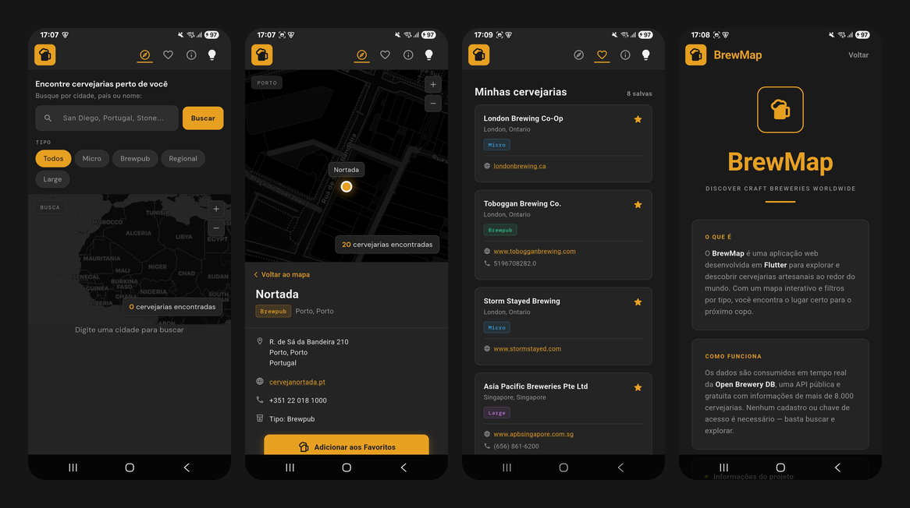
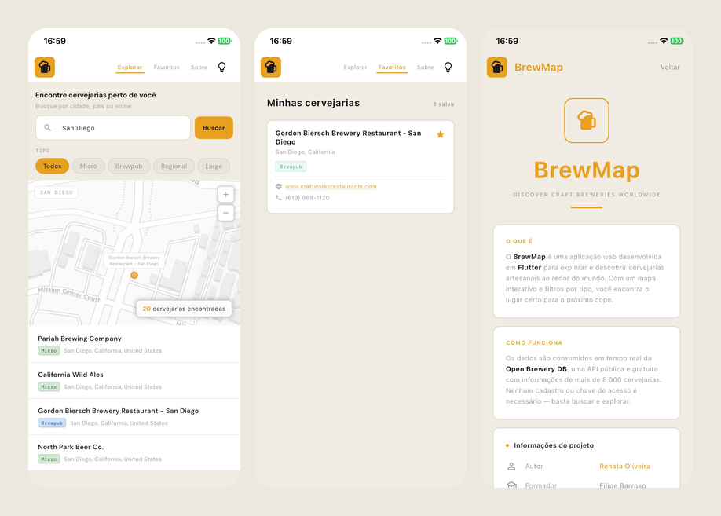
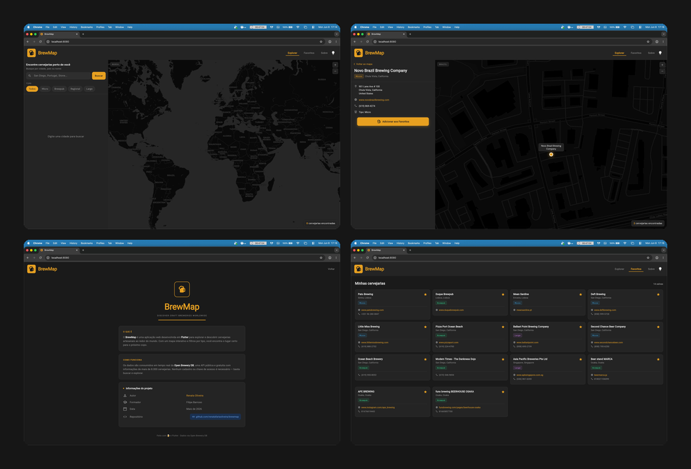
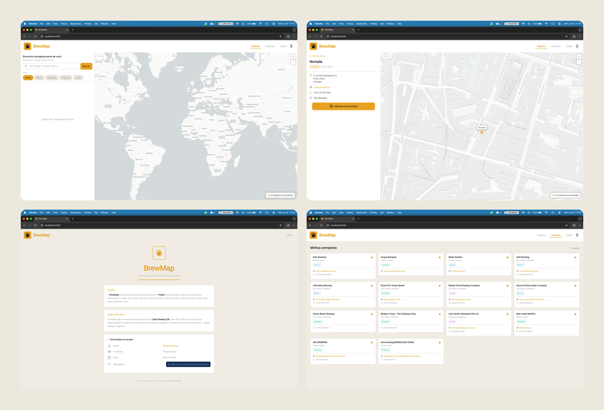

<p align="center">
  
</p>


# BrewMap

[BrewMap Web](https://brewmap-flutter.web.app)

Discover craft breweries worldwide with an interactive map, filters, and favorites.

BrewMap is a Flutter application that lets you search breweries from the [Open Brewery DB](https://www.openbrewerydb.org/) API, explore them on a map, filter by type, and save favorites locally. It targets **web** as the primary platform and also supports **Android** and **iOS**.

---

## Screenshots

### Android

<p align="center">
  
</p>

### iOS

<p align="center">
  
</p>

### Web

<p align="center">
  
</p>

<p align="center">
  
</p>

---

## Features

- **Search** — Find breweries by name or keyword via the Open Brewery DB search endpoint.
- **Interactive map** — View results on a world map with markers and zoom controls (`flutter_map`).
- **Type filters** — Narrow results by brewery type (Micro, Brewpub, Regional, Large).
- **Pagination** — Browse large result sets page by page.
- **Favorites** — Save breweries locally with Hive; favorites persist across sessions.
- **Brewery details** — View address, phone, website, and open external links.
- **Error handling** — User-facing messages in Portuguese; technical details are not shown in the UI.
- **Light / dark theme** — Toggle between themes at runtime; choice persists in Hive across sessions.
- **Responsive layout** — Sidebar layout on wide screens; stacked layout on narrow viewports.

---

## Tech stack


| Layer                | Choice                                                            |
| -------------------- | ----------------------------------------------------------------- |
| Framework            | Flutter 3.x (Dart 3.12+)                                          |
| State management     | `flutter_bloc` (`BreweryCubit`)                                   |
| Dependency injection | `get_it`                                                          |
| HTTP                 | `dio`                                                             |
| Local storage        | `hive_flutter`                                                    |
| Map                  | `flutter_map` + `latlong2`                                        |
| Code generation      | `copy_with_extension` + `build_runner`                            |
| Testing              | `flutter_test`, `bloc_test`, `mocktail`, `gherkart` (Gherkin BDD) |


All Flutter CLI commands in this repo can be run via through **[FVM](https://fvm.app/)** (`fvm flutter …`) to pin the SDK version.

---

## Prerequisites

- Flutter SDK (currently **3.44.1** with Dart **3.12.1**)
- For web: Chrome (or another supported browser)
- For mobile: Xcode (iOS) and/or Android Studio with an emulator or physical device
- Optional — [Node.js](https://nodejs.org/) LTS if you use the **brewmap-devkit** MCP server
- Optional — [FVM](https://fvm.app/documentation/getting-started/installation) installed and on your `PATH`

---

## Getting started

```bash
git clone https://github.com/renatafariaoliveira/brewmap.git
cd brewmap
flutter pub get
```

### Run the app

**Web (recommended for development):**

```bash
flutter run -d chrome
```

**Android / iOS:**

```bash
flutter devices
flutter run -d <device_id>
```

**Release build (web):**

```bash
flutter build web
```

Output is written to `build/web/`.

### Static analysis

```bash
flutter analyze
```

---

## Architecture

The project follows a **feature-first** layout with shared core utilities:

```text
lib/
├── main.dart                 # App entry, theme load/save via Hive
├── core/
│   ├── config/               # DI bootstrap (get_it), compile-time flags
│   ├── network/              # Dio client, API wrapper, logging interceptor
│   ├── storage/              # Hive persistence (favorites, theme mode)
│   ├── theme/                # Colors, typography (Google Fonts)
│   ├── components/           # Shared UI (cards, logo, section titles)
│   ├── logging/
│   └── utils/
└── features/
    ├── breweries/            # Map, search, favorites, cubit, API service
    └── about/                # About / project info screen
```

**Data flow:**

1. `bootstrap()` in `locator.dart` registers `ApiClient`, `HiveStorageService`, `BreweryApiService`, and `BreweryCubit`.
2. `main.dart` loads the saved theme from `HiveStorageService` before `runApp`, then persists changes when the user toggles light/dark.
3. `BreweryCubit` calls `BreweryApiService` for search and `HiveStorageService` for favorites.
4. `MapScreen` holds local UI state (filters, pagination, map selection) and listens to the cubit for async search/favorites.

**External API:** `https://api.openbrewerydb.org/v1/` — no API key required.

---

## Code generation

`BreweryState` uses `@CopyWith` from `copy_with_extension`. Regenerate after changing annotated classes:

```bash
dart run build_runner build --delete-conflicting-outputs
```

---

## Testing

BrewMap has three layers of automated checks:


| Layer                  | Location                     | Command                                                                                                    |
| ---------------------- | ---------------------------- | ---------------------------------------------------------------------------------------------------------- |
| Unit / widget          | `test/core`, `test/features` | `flutter test test/core test/features --dart-define=BREWMAP_BDD_TEST=true` (~102 cases)                |
| Live API (opt-in)      | `test/integration`           | `flutter test test/integration --dart-define=BREWMAP_LIVE_API_TEST=true`                               |
| BDD (VM, offline)      | `test/bdd` + `features/bdd`  | `flutter test test/bdd/bdd_suite_test.dart --dart-define=BREWMAP_BDD_TEST=true`                        |
| BDD (device, optional) | `integration_test`           | `flutter test integration_test/bdd_suite_test.dart -d <device_id> --dart-define=BREWMAP_BDD_TEST=true` |


**Full manual suite:**

```bash
flutter test test/core test/features --dart-define=BREWMAP_BDD_TEST=true
flutter test test/bdd/bdd_suite_test.dart --dart-define=BREWMAP_BDD_TEST=true
```

Pass `--dart-define=BREWMAP_BDD_TEST=true` for unit/widget and BDD runs so map stubs and stable UI behavior are enabled (see `lib/core/config/brewmap_flags.dart`). Without it, map-related widget tests are skipped.

Avoid bare `flutter test` for routine checks — it may run BDD without the flag and skip map widget tests.

### Code coverage

Line coverage is collected from **unit and widget tests only** (`test/core`, `test/features`). BDD scenarios validate UI flows but do not contribute to the LCOV file produced by this command.

**Generate:**

```bash
flutter test test/core test/features --coverage --dart-define=BREWMAP_BDD_TEST=true
```

Output: `coverage/lcov.info` (gitignored). **Current baseline:** ~**79%** line coverage on `lib/` (1283/1623 lines, as of the last unit/widget run with `BREWMAP_BDD_TEST`).

Coverage reflects what unit and widget tests exercise directly. Layers still under-represented include the logging interceptor, DI bootstrap (`locator.dart`), and narrow responsive layout — those are covered mainly by BDD or manual runs.

**Inspect the report:**

| Approach | Command / tool |
| -------- | -------------- |
| MCP `coverage_summary` | Parses `lcov.info` — total %, lowest-coverage files, fully uncovered files |
| MCP `flutter_test` with `coverage: true` | Runs unit/widget tests and writes LCOV |
| MCP `quality_preflight` | Chains analyze → tests → BDD → optional LCOV read (`runCoverageSummary`, `minCoveragePercent`) |
| HTML (optional, requires [lcov](https://github.com/linux-test-project/lcov)) | `genhtml coverage/lcov.info -o coverage/html` then open `coverage/html/index.html` |

`quality_preflight` only **reads** an existing LCOV file — run tests with `--coverage` first, or pass `runCoverageSummary: false` until you have one. See [docs/mcp-brewmap-devkit.md](docs/mcp-brewmap-devkit.md).

Detailed test documentation: [docs/testing.md](docs/testing.md).

---

## brewmap-devkit (MCP for Cursor)

**brewmap-devkit** is a local [Model Context Protocol (MCP)](https://modelcontextprotocol.io/) server that exposes quality tools (`flutter_analyze`, `flutter_test`, `flutter_bdd`, `coverage_summary`, `quality_preflight`) so AI agents in Cursor run the same FVM-based checks as the terminal.

Quick setup:

```bash
cd tools/brewmap-devkit
npm install
```

Register the server in **Cursor Settings → MCP** pointing to `tools/brewmap-devkit/server.mjs`. Full setup, tool reference, and troubleshooting: [docs/mcp-brewmap-devkit.md](docs/mcp-brewmap-devkit.md).

---

## Project layout (repository root)

```text
brewmap/
├── lib/                      # Application source
├── test/                     # Unit, widget, VM BDD, and opt-in live API tests
│   ├── core/                 # Network, storage, utils, theme
│   ├── features/             # Cubit, services, screens, components
│   ├── integration/          # Live Open Brewery DB smoke (opt-in flag)
│   ├── bdd/                  # VM BDD entrypoint
│   └── helpers/              # Shared fakes (brewmap_test_harness)
├── integration_test/         # On-device BDD runner
├── features/bdd/             # Gherkin feature files
├── assets/                   # App icon and images
├── google_fonts/             # Bundled fonts (offline-friendly tests)
├── docs/                     # Testing and MCP documentation
└── tools/brewmap-devkit/     # MCP server for development tooling
```

---

## Acknowledgments

- Data provided by [Open Brewery DB](https://www.openbrewerydb.org/) — a free, public API with information on thousands of breweries worldwide.
- Educational project by **Renata Oliveira** (May 2026), under **Filipe Barroso**.

---

## License

This project is for educational purposes.